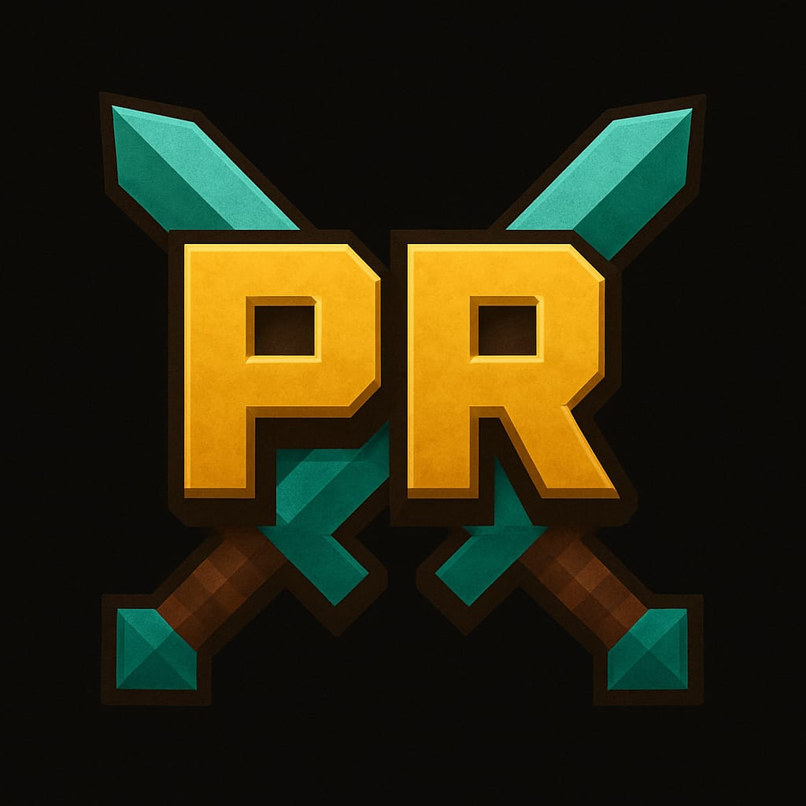

<h2 align="center">Hello, I'm Philipp Zinhobl</h2>

<h2 align="center">
  Hey it's me Philipp Zinhobl, Informatic Education ~ HTL | Software Developer | Technology Enthusiast | Cybersecurity | Web Development | <a href="https://drive.google.com/file/d/14JcEkdm40r_fEIkkBBFLdKOz7PTXOlm_/view?usp=sharing" target="_blank">Resume</a> |
</h2>

---

## 🚀 Polixer RPG

<table>
  <tr>
    <td></td>
    <td>
      <strong>Founder & Developer</strong> 
      <em>PolixerRPG</em> 
      Minecraft RPG for both editions.
    </td>
  </tr>
</table>

---

## 📊 GitHub Stats

  
  

---

  <em>More coming soon. Stay tuned.</em>

